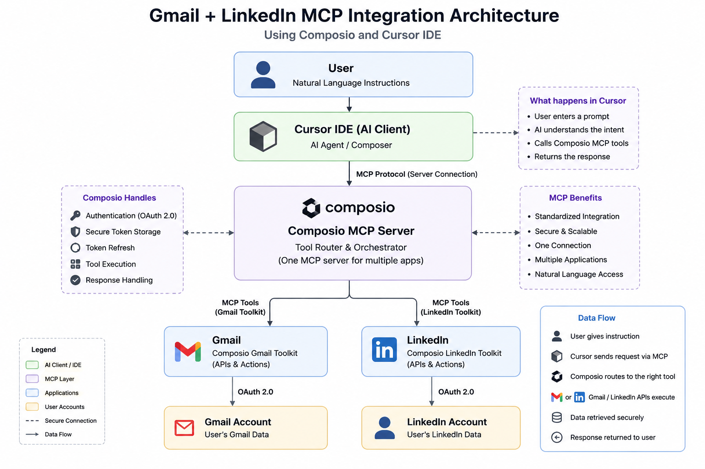

# Gmail & LinkedIn MCP Integration with Composio

## Overview

This project demonstrates how Gmail and LinkedIn can be integrated with
Cursor IDE using the Model Context Protocol (MCP) and Composio.

The integration allows an AI agent to interact with external applications
through MCP tools using natural-language instructions.

## Architecture

The following diagram shows the architecture of the Gmail and LinkedIn
MCP integration using Cursor IDE and Composio.

## Technologies Used

- Cursor IDE
- Model Context Protocol (MCP)
- Composio
- Gmail
- LinkedIn
- OAuth 2.0

## Features

### Gmail

- Gmail account authentication through Composio
- Retrieve recent emails
- Search Gmail messages
- Read Gmail data through MCP tools

### LinkedIn

- LinkedIn account authentication through Composio
- Retrieve LinkedIn profile information
- Access LinkedIn functionality through MCP

## Implementation

### 1. Composio Setup

Composio was connected to Cursor using its MCP server.

### 2. Gmail Authentication

Gmail was authenticated through Composio's OAuth flow.

### 3. LinkedIn Authentication

LinkedIn was authenticated through Composio's OAuth flow.

### 4. MCP Integration

Cursor was connected to the Composio MCP server.

### 5. Gmail Test

Prompt:

"Use Composio Gmail to show me my 5 most recent emails."

The Gmail MCP tool retrieved the email information.

### 6. LinkedIn Test

Prompt:

"Use Composio LinkedIn to get my LinkedIn profile information."

The LinkedIn MCP tool retrieved the profile information.

## Screenshots

### Gmail MCP

### LinkedIn MCP

## Security

No API keys, OAuth tokens, passwords, or other credentials are included
in this repository.

## Conclusion

This project demonstrates how MCP enables an AI agent to securely interact
with external applications through Composio.
